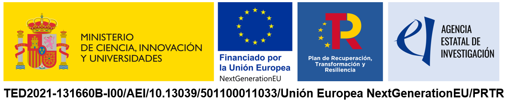

# Ecosons

[](https://gridap.github.io/GridapHybrid.jl/dev)


A refactorized Julia version of the [Ecosons](https://github.com/daniel-rperez/ecosons/tree/master) software written originally in Octave.

## Purpose

The Ecosons Julia package aims to modernize and optimize sonar data processing originally developed in Octave by leveraging Julia's high-performance capabilities. It improves data handling, visualization, and computation time, making it suitable for real-time or large-scale oceanographic applications.

## Example: Load, Process, and Export Echogram Data

You can find this test example in /test/Echogram.jl:

```julia
using EcoSons
using Test
using JSON

@testset begin
    # Load config from JSON
    json_path = joinpath(@__DIR__, "../config/params.json")
    config = JSON.parsefile(json_path)

    # Get .raw files
    dir = joinpath(@__DIR__, config["data_dir"])
    files = filter(f -> endswith(f, ".raw"), readdir(dir))
    full_paths = joinpath.(dir, files)
    channel = config["channel"]

    # Load sonar data
    JLD2_path = joinpath(@__DIR__, config["JLD2_dir"]["data"])
    data, dim = load_sonar_data(channel, full_paths; jld2_path = JLD2_path)

    # Select the transect
    transect = config["transect"]

    # Bottom detection using parameters
    bottom_args = Dict(Symbol(k) => v for (k, v) in config["bottom_detection"])
    data = compute_bottom(data; bottom_args...)

    # Save the data to JLD2
    saveJLD2("$(JLD2_path)_$(channel)", data)

    # Visualize the result
    data_selected = data[transect]
    plot_echobottom(data_selected)

    # Plot the ping's intensity 
    ping = 1
    plot_ping(1:length(data_selected.P[ping, :]), data_selected.P[ping, :])

    # Export to file
    export_dir = joinpath(@__DIR__, "..", "data", "echobottom.dat")
    export_echobottom(data_selected, transect, export_dir)
end
```
The JSON file can be traced [here](config/params.json), and the JSON is documented [here](assets/info/info.md).

Example of an echogram plot: 

<div align="center">
  
</div>


## Documentation

See [CHANGELOG.md](CHANGELOG.md) and the [docs folder](docs/).


## Build

To use the package locally:

1. Open a Julia REPL.
2. Change to the project directory (where `Project.toml` is located). For example:
```julia
cd("EcoSons")  # or the appropriate path to the repo
```
3. Activate the environment:
```julia
using Pkg
Pkg.activate(".")
```
4. Load the package:
```julia
using EcoSons
```

### CRediT authorship contribution statement
**Carlos Vázquez Monzón**: Refactorization, Review, Optimization software.  **Noela Sánchez**: Software, Methodology, Conceptualization. **Daniel Rodríguez**: Software, Methodology, Conceptualization. **A. Prieto**: Review, Supervision, Funding acquisition.

### License
 <p xmlns:cc="http://creativecommons.org/ns#" >This work is licensed under <a href="http://creativecommons.org/licenses/by/4.0/?ref=chooser-v1" target="_blank" rel="license noopener noreferrer" style="display:inline-block;">CC BY 4.0</a></p> 


